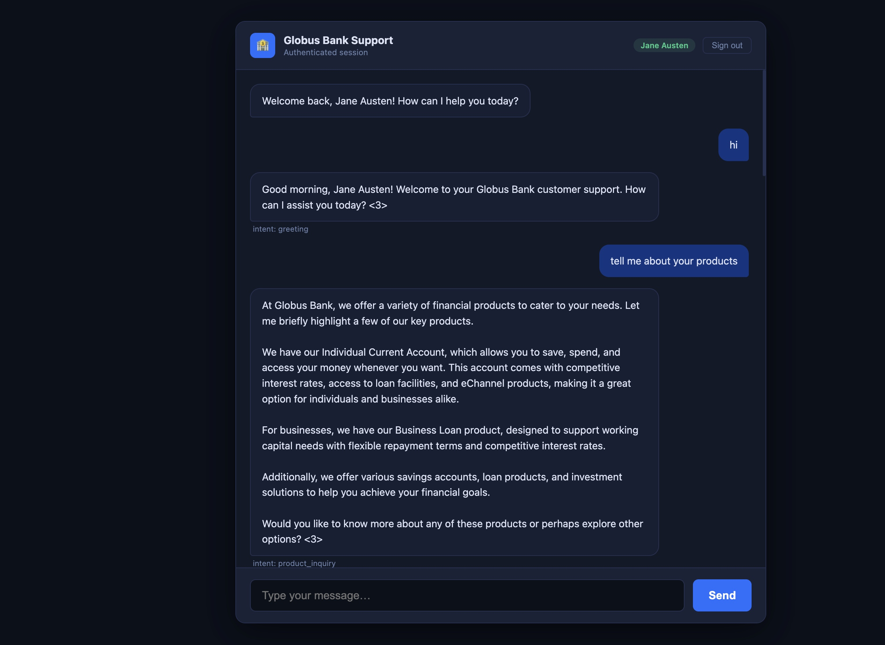

# Globus Bank Support Chatbot

A fully offline AI-powered customer support chatbot for Globus Bank Nigeria, built with Flask, llama.cpp, and sentence-transformers. No internet connection is required after the one-time model download.

## Screenshot



---

## Project Structure

```
globus/
├── app.py                      # Flask entry point & routes
├── config.py                   # All settings and constants
├── requirements.txt
├── download_embeddings.py      # Run once while online to cache the embedding model
│
├── modules/
│   ├── llm.py                  # llama.cpp model loader (singleton)
│   ├── auth.py                 # Excel-based customer lookup (Customer + Card + Transaction sheets)
│   ├── intent.py               # Intent classification via local LLM
│   ├── knowledge_base.py       # Semantic retrieval from products.txt
│   └── response.py             # Response generation + access control
│
├── data/
│   ├── products.txt            # Globus Bank product documentation (source file)
│   └── customers.xlsx          # Customer database (3 sheets: Customer, Transaction, Card)
│
├── models/                     # Place your .gguf model file here
│   └── embeddings/             # Auto-created: cached sentence-transformers model
│
└── templates/
    └── index.html              # Chat UI
```

---

## Architecture

```
User Message
     │
     ▼
intent.py ──── classify into 4 categories (local LLM)
     │
     ▼
knowledge_base.py ── semantic search on products.txt (if product/general intent)
     │
     ▼
response.py ─── enforce access control + build prompt + generate reply (local LLM)
```

### The 4 intents

| Intent | Triggers KB lookup? |
|---|---|
| `greeting` | No |
| `general_inquiry` | Yes |
| `account_information` | No |
| `product_inquiry` | Yes |

### Access control
Enforced in `response.py` — anonymous users asking about account details are blocked at the response layer, not the intent layer. This keeps the classifier pure and independently testable.

### Data sources
| File | Used by |
|---|---|
| `data/products.txt` | `knowledge_base.py` — chunked, embedded, and searched semantically |
| `data/customers.xlsx` | `auth.py` — Customer, Card, and Transaction sheets joined in memory at startup |

---

## Setup

### 1. Install dependencies

```bash
pip install -r requirements.txt
```

### 2. Download the embedding model (once, while online)

```bash
python download_embeddings.py
```

This caches `all-MiniLM-L6-v2` (~90 MB) into `models/embeddings/`. After this the app runs fully offline. The offline flags are set in `config.py` at the top of the file before any other imports, which prevents sentence-transformers and HuggingFace from making any network calls at runtime.

### 3. Download the LLM (once, while online)

```bash
mkdir -p models

# Recommended: Llama-3.2-3B-Instruct-Q4_K_M (~2.0 GB)
curl -L -o models/Llama-3.2-3B-Instruct-Q4_K_M.gguf \
  https://huggingface.co/bartowski/Llama-3.2-3B-Instruct-GGUF/resolve/main/Llama-3.2-3B-Instruct-Q4_K_M.gguf
```

### 4. Run

```bash
python app.py
```

Open: **http://localhost:5050**

---

## API Endpoints & Postman Testing

> **Note:** Postman handles session cookies automatically on the desktop app. Make sure you use the same Postman session/tab across all requests so the Flask session persists.

---

### 1. `POST /api/authenticate`
Must be called first. Validates the account number and initialises the session.

**Body:**
```json
{ "account_number": "100023489" }
```

**Response (found):**
```json
{ "success": true, "name": "John Doe", "message": "Welcome back, John Doe! How can I help you today?" }
```

**Response (not found):**
```json
{ "success": false, "name": null, "message": "I couldn't find a Globus Bank account matching that number..." }
```

---

### 2. `POST /api/chat`
Sends a message and gets a reply. **No need to specify intent** — the bot classifies it automatically from the message text. Just send the message as plain text.

**Body:**
```json
{ "message": "What is my account balance?" }
```

**Response:**
```json
{
  "reply": "Your Globus Staff Account (NGN) has a balance of NGN 79,342.00...",
  "intent": "account_information"
}
```

The `intent` field in the response shows you what the bot classified your message as — useful for debugging but you never need to send it.

**Example messages to test each intent:**

| Intent | Try sending |
|---|---|
| `greeting` | `"Hello"` |
| `account_information` | `"What is my balance?"`, `"Show my recent transactions"`, `"What cards do I have?"` |
| `product_inquiry` | `"Tell me about your loan products"`, `"What is a Treasury Bill?"` |
| `general_inquiry` | `"How can you help me?"` |

**Response (no active session — 403):**
```json
{ "error": "Please enter your account number first." }
```

---

### 3. `POST /api/reset`
Clears the session. No body required.

**Response:**
```json
{ "message": "Session cleared." }
```

---

### Postman test flow

**Authenticated user:**
1. `POST /api/authenticate` → `{"account_number": "100023489"}`
2. `POST /api/chat` → `{"message": "What is my balance?"}`
3. `POST /api/chat` → `{"message": "Tell me about mortgage loans"}`
4. `POST /api/reset`

**Anonymous user (product queries only):**
1. `POST /api/authenticate` → `{"account_number": "000000000"}` (invalid)
2. `POST /api/chat` → `{"message": "What savings accounts do you offer?"}` — works
3. `POST /api/chat` → `{"message": "What is my balance?"}` — blocked with restriction message

---

## Test Account Numbers

| Account No | Name | Currency | Product |
|---|---|---|---|
| `100023489` | John Doe | NGN | Globus Staff Account |
| `200034590` | John Doe | USD | Globus Dollar Account |
| `100089028` | Jane Austen | NGN | Globus Savings Account |
| `300122349` | Charles Dickens | GBP | Globus Pound Account |
| `100002348` | Emily Blunt | NGN | Globus Savings Account |

> John Doe has two accounts — authenticating with either number returns his full profile including both accounts.

---

## Configuration (config.py)

| Setting | Default | Description |
|---|---|---|
| `LLM_THREADS` | `4` | CPU threads — set to your core count |
| `LLM_GPU_LAYERS` | `0` | GPU offload layers (set >0 for CUDA/Metal) |
| `LLM_MAX_TOKENS` | `512` | Max response length |
| `LLM_TEMPERATURE` | `0.4` | Response randomness |
| `KB_TOP_K` | `3` | Product doc chunks retrieved per query |
| `MAX_HISTORY_TURNS` | `8` | Conversation memory depth |

---

## Extending

**Add more customers:** Add rows to `customers.xlsx` — no code changes, just restart.

**Add more product docs:** Append to `products.txt` — index rebuilds on restart.

**Migrate to Chroma:** Replace the body of `get_relevant_info()` in `knowledge_base.py`. Interface stays the same.

**Add more intents:** Add to `INTENTS` in `config.py` and update the classifier prompt in `intent.py`.